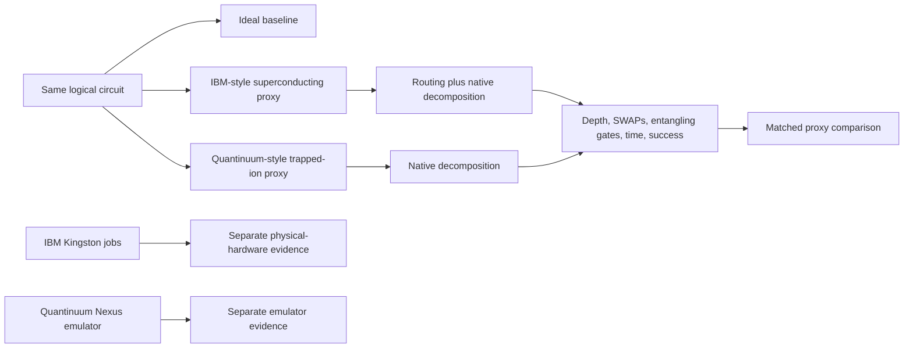
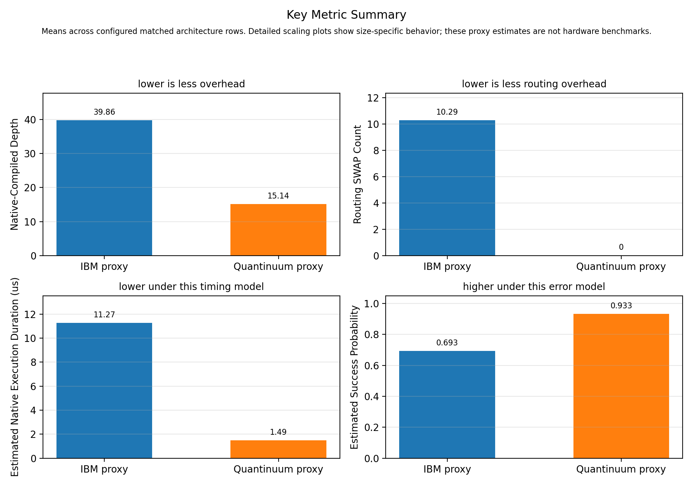
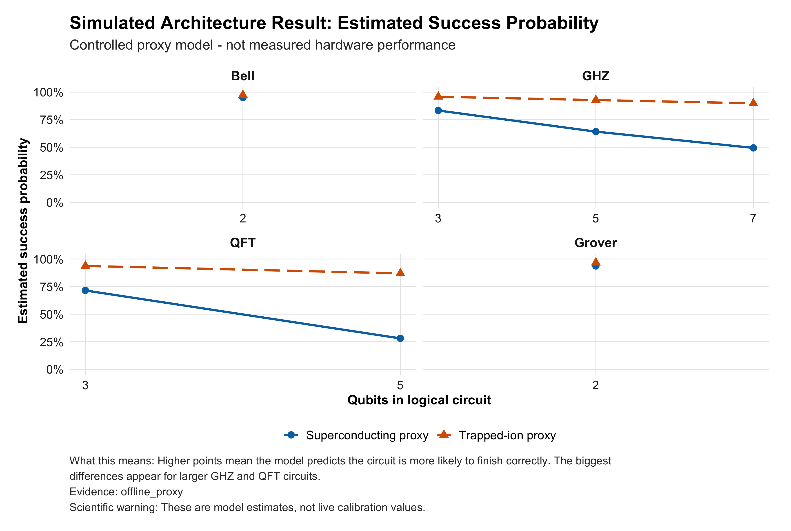
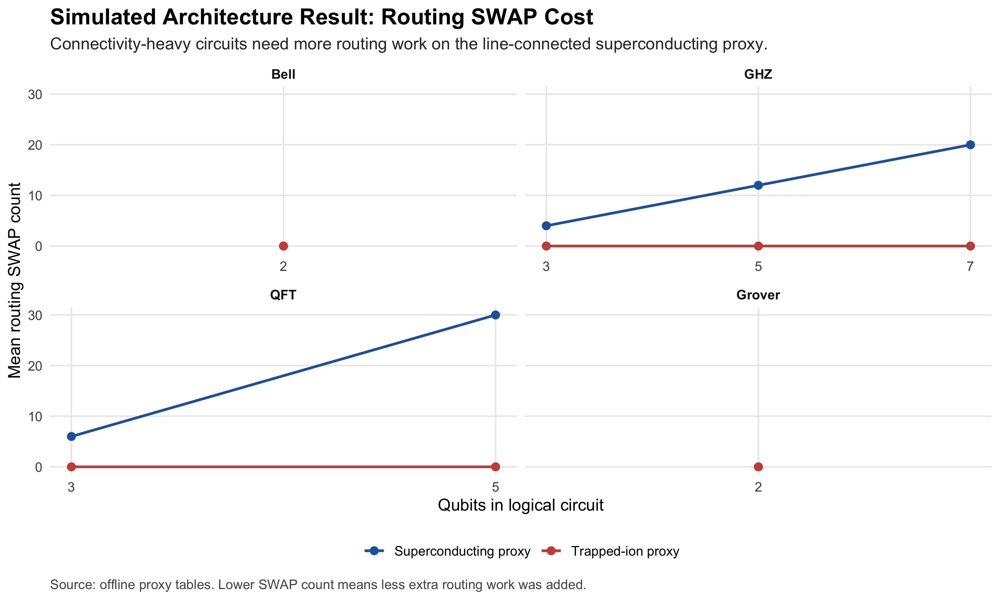
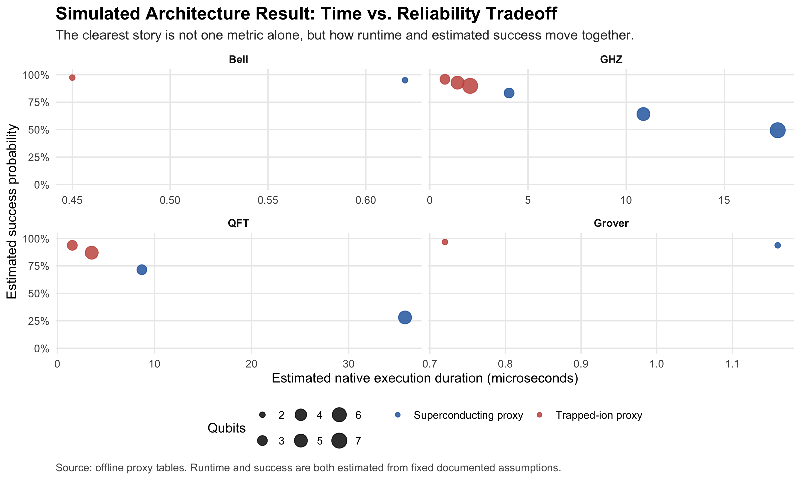
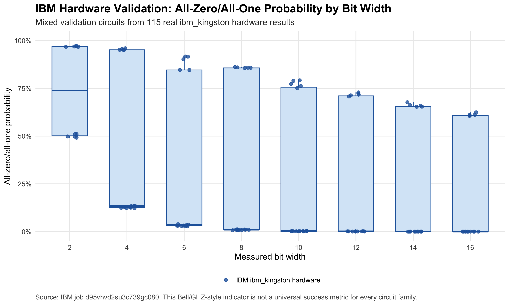
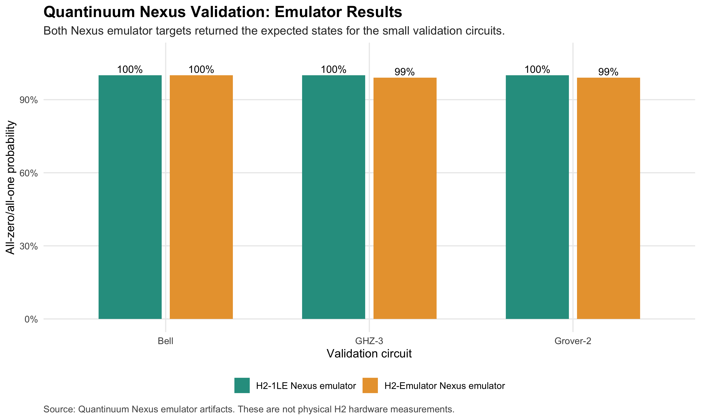

<p align="center">
  
</p>

<h1 align="center">Different Roads to the Same Circuit</h1>

<p align="center"><strong>A visual, reproducible comparison of how superconducting-style and trapped-ion-style constraints change the same quantum circuits.</strong></p>

<p align="center">
  <a href="https://github.com/Braytech-Findings/SCSU-WERTH-Quantum-Computing-Project/actions/workflows/ci.yml"></a>
  
  
  
  
  
  <a href="LICENSE"></a>
</p>

<p align="center">
  <a href="#start-here"><strong>Start here</strong></a> ·
  <a href="#visual-results"><strong>Visual results</strong></a> ·
  <a href="#reproduce-the-project"><strong>Reproduce everything</strong></a> ·
  <a href="docs/PROJECT_SHOWCASE.md"><strong>Figure gallery</strong></a> ·
  <a href="docs/BEGINNER_GUIDE.md"><strong>Beginner guide</strong></a> ·
  <a href="docs/MANUSCRIPT_REPOSITORY_ALIGNMENT.md"><strong>Manuscript alignment</strong></a>
</p>

---

## The project in one sentence

**When the exact same logical circuit is prepared for two different hardware styles, how much extra routing, depth, entangling work, estimated time, and estimated error does each architecture introduce?**

> [!IMPORTANT]
> The main architecture tables are controlled **offline proxy-model results**. IBM physical-hardware evidence and Quantinuum Nexus emulator evidence are stored separately. This repository does not claim a matched physical IBM-versus-Quantinuum QPU benchmark or a universal hardware winner.

## Start here

<table>
<tr>
<td width="25%" align="center"><strong>🧠 Learn</strong><br><a href="docs/BEGINNER_GUIDE.md">Beginner guide</a><br><a href="docs/GLOSSARY.md">Glossary</a></td>
<td width="25%" align="center"><strong>📊 See</strong><br><a href="docs/PROJECT_SHOWCASE.md">Visual showcase</a><br><a href="docs/FIGURE_INTERPRETATION_GUIDE.md">Figure guide</a></td>
<td width="25%" align="center"><strong>🧪 Recreate</strong><br><a href="docs/REPRODUCE_EVERYTHING.md">Full reproduction guide</a><br><a href="#one-command-reproduction">One command</a></td>
<td width="25%" align="center"><strong>🔍 Verify</strong><br><a href="docs/EXPERIMENT_PROTOCOL.md">Protocol</a><br><a href="docs/LIMITATIONS.md">Limitations</a></td>
</tr>
</table>

### Choose your path

| Reader | Best first stop |
|---|---|
| New to quantum computing | [Beginner guide](docs/BEGINNER_GUIDE.md) |
| Wants the main visual story | [Project showcase](docs/PROJECT_SHOWCASE.md) |
| Wants to rerun every public result | [Reproduce Everything](docs/REPRODUCE_EVERYTHING.md) |
| Wants the code explained file by file | [Code walkthrough](docs/CODE_WALKTHROUGH.md) and [plain-English file guide](docs/PLAIN_ENGLISH_FILE_GUIDE.md) |
| Wants exact methods and columns | [Experiment protocol](docs/EXPERIMENT_PROTOCOL.md) and [data dictionary](docs/DATA_DICTIONARY.md) |
| Wants provider evidence | [IBM validation](docs/IBM_HARDWARE_VALIDATION.md) and [Quantinuum validation](docs/QUANTINUUM_HARDWARE_VALIDATION.md) |
| Wants scientific boundaries | [Limitations](docs/LIMITATIONS.md) and [manuscript alignment](docs/MANUSCRIPT_REPOSITORY_ALIGNMENT.md) |

## Why this matters

Quantum algorithms are written with logical gates, but hardware cannot always execute those gates directly. A compiler must translate the circuit into native operations and obey the machine's connectivity rules.

That translation can add:

- **SWAP gates** that move quantum information;
- **extra entangling gates** after decomposition;
- **greater circuit depth**;
- **longer estimated execution time**; and
- **more opportunities for error**.

This project makes those hidden architecture costs visible, measurable, and reproducible.

## Study design



### Circuit families

| Family | Sizes | Purpose |
|---|---:|---|
| Bell | 2 qubits | Basic entanglement and pipeline sanity |
| GHZ | 3, 5, and 7 qubits | Connectivity and scaling pressure |
| QFT | 3 and 5 qubits | Dense interaction requirements |
| Grover | 2 qubits | Small search-circuit behavior |

### Architecture models

| Model | Connectivity | Native basis | Routing expectation |
|---|---|---|---|
| IBM-style superconducting proxy | Line coupled | `rz`, `sx`, `x`, `cx` | Non-neighbor interactions may require SWAPs |
| Quantinuum-style trapped-ion proxy | All to all | `rz`, `rx`, `rzz` proxy | No topology SWAPs for these tested circuits |

## Evidence map

| Evidence type | Visual label | What it supports | What it does **not** support |
|---|---|---|---|
| Offline proxy model | 🟦 Controlled comparison | Matched compilation behavior under fixed assumptions | Live device ranking |
| IBM physical hardware | 🟩 Measured hardware | Real counts from saved IBM Kingston jobs | Matched cross-provider QPU comparison |
| Quantinuum emulator | 🟪 Provider emulator | Workflow and small-circuit emulator validation | Physical H2 performance claims |
| Syntax checker / qBraid | 🟨 Reproducibility | Compatibility and environment checks | Execution outcomes |

## Visual results

The verified baseline is `data/processed/results_20260623T223649Z.csv` with **63 rows**: 21 ideal baseline rows and 42 architecture-proxy rows.

1. **Small circuits hide architecture differences.** Bell and the current 2-qubit Grover circuit are too small to create meaningful routing separation.
2. **Connectivity matters as circuits grow.** GHZ and QFT require more routing work on the line-coupled superconducting proxy.
3. **The conclusion is structural, not a universal ranking.** The trapped-ion proxy performs better under this study's selected proxy assumptions for the tested matched circuits, but those assumptions are not physical cross-provider measurements.

<p align="center">
  
</p>

### Curated figure wall

<table>
<tr>
<td width="50%" align="center">
<a href="results/final_figures/01_simulated_success_probability.png"></a><br>
<strong>🟦 Modeled success</strong><br>Proxy-estimated reliability separates most for larger GHZ and QFT circuits.
</td>
<td width="50%" align="center">
<a href="results/final_figures/02_simulated_routing_swap_cost.png"></a><br>
<strong>🟦 Routing detours</strong><br>Line-limited connectivity adds SWAP work as interaction distance grows.
</td>
</tr>
<tr>
<td width="50%" align="center">
<a href="results/final_figures/03_simulated_time_reliability_tradeoff.png"></a><br>
<strong>🟦 Time–reliability tradeoff</strong><br>Estimated duration and success are shown together under fixed proxy assumptions.
</td>
<td width="50%" align="center">
<a href="results/final_figures/04_ibm_hardware_expected_state_probability.png"></a><br>
<strong>🟩 IBM Kingston hardware</strong><br>Real saved hardware counts, deliberately separate from proxy estimates.
</td>
</tr>
<tr>
<td colspan="2" align="center">
<a href="results/final_figures/05_quantinuum_nexus_emulator_validation.png"></a><br>
<strong>🟪 Quantinuum Nexus emulator</strong><br>Small-circuit provider-emulator validation; not a physical H2 QPU measurement.
</td>
</tr>
</table>

See the [full visual showcase](docs/PROJECT_SHOWCASE.md) for graph-by-graph explanations written for technical and nontechnical readers.

## Reproduce the project

### One-command reproduction

From the repository root in Python 3.11 or newer:

```bash
python scripts/reproduce_everything.py --install
```

Preview the full workflow without executing it:

```bash
python scripts/reproduce_everything.py --dry-run --install --include-r
```

Add the optional R visualization package:

```bash
python scripts/reproduce_everything.py --install --include-r
```

The runner is intentionally **offline and credit-safe**. It never submits provider jobs.

### Manual quickstart

```bash
python -m venv .venv
source .venv/bin/activate            # Windows: .venv\Scripts\Activate.ps1
python -m pip install --upgrade pip
python -m pip install -e .
python -m quantum_compare.cli check
pytest -q
python -m quantum_compare.cli run --backend all --suite core
python -m quantum_compare.cli report
python scripts/compare_run_artifacts.py \
  --baseline data/processed/results_20260623T223649Z.csv
```

Read [Reproduce Everything](docs/REPRODUCE_EVERYTHING.md) for Windows instructions, expected outputs, optional R steps, qBraid steps, troubleshooting, and the line between reproducible offline results and historical provider evidence.

### Command-line reference

| Goal | Command |
|---|---|
| Check installation | `quantum-compare check` |
| List adapters | `quantum-compare devices` |
| Run the full controlled suite | `quantum-compare run --backend all --suite core` |
| Rebuild figures and reports | `quantum-compare report` |
| Export a circuit without submitting | `quantum-compare hardware-guide --provider all --export-family bell --export-size 2` |

`python -m quantum_compare.cli ...` is equivalent.

## What is measured

- logical, routed, and native-compiled depth;
- routing SWAP count;
- native entangling-gate count;
- estimated native execution duration;
- estimated success probability;
- unsupported native-operation count; and
- logical-to-native equivalence status.

Unavailable values are stored as `null`, never fabricated as zero. Measurement bitstrings follow Qiskit endianness conventions.

## Repository map

```text
.
├── analysis/                 R-based figure generation
├── config/                   Experiment configuration
├── data/processed/           Versioned outputs and verified baseline
├── docs/                     Guides, methods, limitations, and validation
│   └── assets/               Colorful visual identity and diagrams
├── notebooks/                qBraid validation notebook
├── reports/                  Expanded written analysis
├── results/
│   ├── figures/              Generated Python figures
│   ├── final_figures/        Curated presentation-ready figures
│   ├── hardware/             Sanitized provider evidence
│   ├── reports/              Generated summaries
│   └── tables/               Generated result tables
├── scripts/                  Reproduction and provider helper scripts
├── src/quantum_compare/      Core Python package
└── tests/                    Unit, smoke, backend, and visualization tests
```

## Technical stack

**Python 3.11+ · Qiskit · Qiskit Aer · NumPy · pandas · Matplotlib · PyYAML · pytest · Ruff · mypy · R/ggplot2 · IBM Quantum · Quantinuum Nexus · qBraid**

## Real-provider boundary

The repository contains sanitized IBM hardware and Quantinuum emulator artifacts, but public reproduction does not submit new provider jobs. A new hardware run would be a new experiment because calibration, queues, compiler versions, access, and backend behavior can change.

Prepare an export without submitting anything:

```bash
python -m quantum_compare.cli hardware-guide \
  --provider all \
  --export-family bell \
  --export-size 2
```

Always request cost estimates, protect credentials, label evidence accurately, and keep provider results separate from offline proxy tables.

## Scope and limitations

- The architecture comparison uses architecture-aware offline proxies.
- Timing and success values depend on fixed modeling assumptions.
- The Quantinuum proxy uses Qiskit `rzz` as a ZZ-type operation proxy rather than an official matched pytket compilation study.
- The controlled circuit set is intentionally small.
- The repository does not contain a matched physical IBM-versus-Quantinuum QPU experiment.
- The findings do not establish a universally superior architecture.

Read [LIMITATIONS.md](docs/LIMITATIONS.md) before reusing results.

## Manuscript relationship

The July 2026 manuscript is titled **“Do Standardized Quantum Algorithms Perform Differently Across Hardware?”** The repository is the broader public code, data, documentation, validation, and figure archive.

The manuscript's main statistical IBM analysis uses the original 90-circuit Kingston GHZ stress experiment. The later 115-circuit IBM validation package and Quantinuum Nexus emulator package are supplemental evidence. See [manuscript–repository alignment](docs/MANUSCRIPT_REPOSITORY_ALIGNMENT.md).

## Contributing

Improvements that strengthen reproducibility, documentation, testing, accessibility, or scientifically cautious interpretation are welcome. Read [CONTRIBUTING.md](CONTRIBUTING.md), [SECURITY.md](SECURITY.md), and [CODE_OF_CONDUCT.md](CODE_OF_CONDUCT.md).

## Citation

Use [CITATION.cff](CITATION.cff):

```text
Aly, Abdellah. (2026). Different Roads to the Same Circuit:
Quantum Architecture Comparison (Version 1.0.0).
```

## License and confidentiality

Code and public documentation are released under the [MIT License](LICENSE). This repository is a sanitized independent research implementation and excludes confidential or nondisclosure-protected material.

---

<p align="center"><strong>Built to make quantum hardware constraints understandable, visual, testable, and honest.</strong></p>
