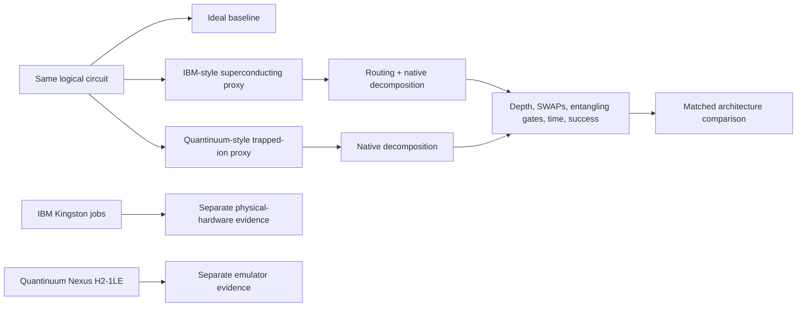

<div align="center">

# Different Roads to the Same Circuit

### A reproducible quantum-architecture comparison across superconducting and trapped-ion models

[](https://github.com/Braytech-Findings/SCSU-WERTH-Quantum-Computing-Project/actions/workflows/ci.yml)
[](https://www.python.org/)
[](https://www.ibm.com/quantum/qiskit)
[](LICENSE)
[](FINAL_STATUS.md)

**Same logical circuits. Different hardware constraints. Measurable compilation consequences.**

[Start here](#start-here) · [See the results](#key-results) · [Run the project](#quickstart) · [Read the manuscript notes](docs/MANUSCRIPT_REPOSITORY_ALIGNMENT.md) · [Browse the figure gallery](docs/PROJECT_SHOWCASE.md)

</div>

---

## The project in one sentence

This project asks: **when the same quantum circuit is prepared for two different hardware styles, how much extra routing, depth, entangling work, estimated time, and estimated error does each architecture introduce?**

The comparison uses:

- an **IBM-style superconducting proxy** with line-limited qubit connectivity;
- a **Quantinuum-style trapped-ion proxy** with all-to-all connectivity;
- separate **IBM Quantum physical-hardware evidence**; and
- separate **Quantinuum Nexus emulator evidence**.

> [!IMPORTANT]
> The offline architecture tables are **proxy-model results**, not a direct IBM-versus-Quantinuum physical-QPU benchmark. Physical hardware, emulator, syntax-checker, and proxy evidence are deliberately kept separate.

## Start here

| Reader | Best first stop |
|---|---|
| New to quantum computing | [Beginner guide](docs/BEGINNER_GUIDE.md) |
| Wants the main visual story | [Project showcase](docs/PROJECT_SHOWCASE.md) |
| Wants the methods | [Experiment protocol](docs/EXPERIMENT_PROTOCOL.md) |
| Wants the code explained | [Code walkthrough](docs/CODE_WALKTHROUGH.md) |
| Wants the data columns defined | [Data dictionary](docs/DATA_DICTIONARY.md) |
| Wants the limitations | [Limitations](docs/LIMITATIONS.md) |
| Wants IBM validation details | [IBM hardware validation](docs/IBM_HARDWARE_VALIDATION.md) |
| Wants Quantinuum validation details | [Quantinuum Nexus validation](docs/QUANTINUUM_HARDWARE_VALIDATION.md) |
| Wants manuscript alignment | [Manuscript–repository alignment](docs/MANUSCRIPT_REPOSITORY_ALIGNMENT.md) |

## Why this matters

Quantum algorithms are written as logical gates, but real devices cannot always execute those gates directly. A compiler must translate the circuit into the device's native operations and obey its connectivity rules.

That translation can add:

- **SWAP gates** to move quantum information;
- **extra entangling gates** after decomposition;
- **greater circuit depth**;
- **longer estimated execution time**; and
- **more opportunities for error**.

This project makes those hidden architecture costs visible and reproducible.

## Study design



### Circuit families

| Family | Sizes in the controlled suite | What it helps expose |
|---|---:|---|
| Bell | 2 qubits | Basic entanglement and pipeline sanity |
| GHZ | 3, 5, and 7 qubits | Connectivity and scaling pressure |
| QFT | 3 and 5 qubits | Dense interaction requirements |
| Grover | 2 qubits | Small search-circuit behavior |

### Architectures

| Model | Connectivity assumption | Native unitary basis | Expected routing behavior |
|---|---|---|---|
| IBM-style superconducting proxy | Line coupled | `rz`, `sx`, `x`, `cx` | Non-neighbor interactions may require SWAPs |
| Quantinuum-style trapped-ion proxy | All to all | `rz`, `rx`, `rzz` proxy | No topology SWAPs for the tested circuits |

## Evidence map

| Phase | Evidence type | What it supports | What it does **not** support |
|---|---|---|---|
| I | Offline architecture proxies | Controlled, matched compilation comparison | Live device ranking |
| II | IBM Kingston physical hardware | Real measured counts from IBM hardware | Matched IBM-versus-Quantinuum QPU comparison |
| III | Quantinuum Nexus emulator | Provider-hosted emulator execution and workflow validation | Physical Quantinuum H2 performance claims |
| Supporting | Syntax checker and qBraid validation | Compatibility, reproducibility, and pipeline checks | Hardware execution outcomes |

## Key results

The verified proxy baseline is `data/processed/results_20260623T223649Z.csv` and contains **63 rows**: 21 ideal baseline rows and 42 architecture-proxy rows.

1. **Small circuits hide architecture differences.** Bell and the current 2-qubit Grover circuit are too small to create meaningful routing separation.
2. **Connectivity matters as circuits grow.** GHZ and QFT circuits require more routing work on the line-coupled IBM proxy.
3. **The result is structural, not a universal winner.** Under this study's fixed proxy assumptions, the trapped-ion proxy has lower estimated duration and higher estimated success for the tested matched circuits, but that does not prove universal hardware superiority.

<div align="center">
  
  <p><em>Controlled proxy comparison across the project's key compilation and performance-estimate metrics.</em></p>
</div>

### Curated evidence figures

<table>
<tr>
<td width="50%" align="center">
<br>
<strong>Routing cost</strong><br>
Line-limited connectivity creates detours for larger circuits.
</td>
<td width="50%" align="center">
<br>
<strong>Time–reliability tradeoff</strong><br>
Proxy timing and error assumptions show the modeled cost of added work.
</td>
</tr>
<tr>
<td width="50%" align="center">
<br>
<strong>IBM physical hardware</strong><br>
Saved IBM Kingston job evidence, kept separate from proxy tables.
</td>
<td width="50%" align="center">
<br>
<strong>Quantinuum Nexus emulator</strong><br>
Provider-emulator evidence, not physical H2 QPU measurement.
</td>
</tr>
</table>

See the [full visual gallery and plain-language interpretations](docs/PROJECT_SHOWCASE.md).

## Metrics recorded

- logical, routed, and native-compiled depth;
- routing SWAP count;
- native entangling-gate count;
- estimated native execution duration;
- estimated success probability;
- unsupported native-operation count; and
- logical-to-native equivalence status.

Unavailable values are stored as `null`, not fabricated as zero. Measurement bitstrings follow Qiskit endianness conventions.

## Quickstart

### 1. Install

```bash
python -m venv .venv
source .venv/bin/activate
python -m pip install --upgrade pip
python -m pip install -e .
```

Windows PowerShell activation:

```powershell
.venv\Scripts\Activate.ps1
```

### 2. Check the environment

```bash
python -m quantum_compare.cli check
```

### 3. Run the controlled proxy suite

```bash
python -m quantum_compare.cli run --backend all --suite core
```

### 4. Regenerate figures and reports

```bash
python -m quantum_compare.cli report
```

### 5. Validate the code

```bash
pytest
ruff check .
mypy src tests
```

The default workflow is **offline and credit-safe**. It does not submit IBM or Quantinuum jobs and does not require provider API keys.

## Reproducibility

Compare a regenerated run with the verified public baseline:

```bash
python scripts/compare_run_artifacts.py \
  --baseline data/processed/results_20260623T223649Z.csv
```

Generate the expanded R figure package:

```bash
Rscript analysis/generate_final_figures_r.R
```

The qBraid validation pathway checks imports, versions, tests, experiment execution, report generation, stored hardware-artifact presence, and comparison with the verified baseline. See [qBraid validation](docs/QBRAID_VALIDATION.md).

## Real-provider workflow

Export the same measured logical circuit used by the comparison without submitting a job:

```bash
python -m quantum_compare.cli hardware-guide \
  --provider all \
  --export-family bell \
  --export-size 2
```

Provider work should remain intentionally separate:

- request cost estimates before spending credits;
- never mix proxy estimates with measured hardware results;
- label emulator and syntax-checker outputs accurately; and
- save sanitized provider artifacts under `results/hardware/`.

## Repository map

```text
.
├── analysis/                 # R-based figure generation
├── config/                   # Experiment configuration
├── data/processed/           # Versioned processed outputs and baseline
├── docs/                     # Methods, guides, limitations, and validation notes
├── notebooks/                # qBraid validation notebook
├── reports/                  # Expanded written analysis
├── results/
│   ├── figures/              # Generated Python figures
│   ├── final_figures/        # Curated presentation-ready figures
│   ├── hardware/             # Sanitized provider evidence
│   ├── reports/              # Generated summaries
│   └── tables/               # Generated result tables
├── scripts/                  # Reproduction and provider helper scripts
├── src/quantum_compare/      # Core Python package
└── tests/                    # Unit, smoke, backend, and visualization tests
```

For a non-coder explanation of every major file, read the [plain-English file guide](docs/PLAIN_ENGLISH_FILE_GUIDE.md).

## Technical stack

- **Python 3.11+**
- **Qiskit** and **Qiskit Aer**
- **NumPy**, **pandas**, **Matplotlib**, and **PyYAML**
- **pytest**, **Ruff**, and **mypy**
- **R** with `ggplot2`, `dplyr`, `tidyr`, `readr`, and `scales`
- IBM Quantum, Quantinuum Nexus, and qBraid validation pathways

## Scope and limitations

- The architecture comparison is based on architecture-aware offline proxies.
- Proxy timing and success values depend on fixed assumptions.
- The Quantinuum proxy uses Qiskit `rzz` as a ZZ-type native-operation proxy rather than official pytket compilation passes.
- The tested circuit set is intentionally small.
- Repetitions are deterministic unless compiler seeds are varied in future work.
- The repository includes real IBM hardware evidence and Quantinuum emulator evidence, but no matched physical IBM-versus-Quantinuum QPU experiment.
- The findings do not establish a universally superior architecture.

Read the complete [limitations document](docs/LIMITATIONS.md) before reusing the results.

## Manuscript relationship

The formal July 2026 manuscript is titled **“Do Standardized Quantum Algorithms Perform Differently Across Hardware?”** This repository is the broader public code, data, validation, documentation, and figure archive titled **“Different Roads to the Same Circuit.”**

The manuscript's primary statistical IBM analysis uses the original 90-circuit Kingston GHZ stress experiment. The later 115-circuit IBM validation package and Quantinuum Nexus emulator package are supplemental repository evidence. See [manuscript–repository alignment](docs/MANUSCRIPT_REPOSITORY_ALIGNMENT.md).

## Contributing

Thoughtful improvements are welcome, especially additions that strengthen reproducibility, documentation, testing, or scientifically cautious interpretation. Read [CONTRIBUTING.md](CONTRIBUTING.md) before opening a pull request.

## Citation

Use the repository's [CITATION.cff](CITATION.cff) metadata:

```text
Aly, Abdellah. (2026). Different Roads to the Same Circuit:
Quantum Architecture Comparison (Version 1.0.0).
```

## License and confidentiality

Code and public documentation are released under the [MIT License](LICENSE).

This repository is a sanitized independent research implementation. It excludes confidential company information and material protected by nondisclosure agreements.

---

<div align="center">

**Built to make quantum hardware constraints understandable, testable, and honest.**

</div>
