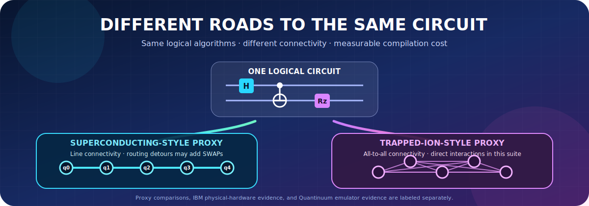

<p align="center"></p>

# Different Roads to the Same Circuit: Quantum Architecture Comparison

## July 23, 2026 Full-Suite Quantinuum Emulator Validation

The expanded Quantinuum Nexus emulator package completed Bell-2, GHZ-3, GHZ-5,
GHZ-7, Grover-2, QFT-3, and QFT-5 on `H2-1LE` and `H2-Emulator`. Each target used
1,000 shots per circuit and three repetitions (42,000 retrieved shots total). The
original July 14 three-circuit artifacts remain unchanged. See
`results/reports/quantinuum_full_suite_emulator_report.md`.

Quantinuum Nexus emulator execution validates the standardized workflow and output
distributions on emulator targets. It does not constitute physical Quantinuum
trapped-ion QPU evidence and does not complete a matched physical IBM-versus-Quantinuum
benchmark.

[](pyproject.toml)
[](.github/workflows/tests.yml)
[](LICENSE)
[](docs/EXPERIMENT_PROTOCOL.md)

**Navigate:** [What is this?](#overview) · [Like I am 10](#explain-it-like-i-am-10) · [Results](#major-findings) · [Install](docs/INSTALLATION.md) · [Run](docs/RUNNING_THE_PROJECT.md) · [Glossary](docs/GLOSSARY.md) · [Figures](docs/FIGURE_INTERPRETATION_GUIDE.md) · [Limitations](docs/LIMITATIONS.md)

## Overview

In one sentence: this project asks, "If we give two different quantum-computer styles
the same small circuits, how much does each style have to rewrite those circuits before
it can run them?"

This repository is a sanitized independent research implementation comparing how the
same logical quantum circuits compile under two architecture-aware proxy models, then
recording real IBM Quantum hardware validation as separate evidence. The architecture
comparison tables use an IBM-style superconducting proxy and a Quantinuum-style
trapped-ion proxy. The provider validation files show what an actual IBM backend and a
Quantinuum Nexus emulator target returned for submitted jobs.

The study is intentionally cautious. The proxy tables are not direct hardware
benchmarks, and they do not claim measured device fidelity, measured execution time,
queue behavior, or live calibration performance. Estimated native execution duration
and estimated success probability come from documented proxy assumptions. Real IBM
hardware counts and Quantinuum Nexus emulator counts are saved separately under
`results/hardware/`.

## Relationship To The July 2026 Manuscript

The formal manuscript for this project is titled **"Do Standardized Quantum Algorithms
Perform Differently Across Hardware?"** The repository release is titled **"Different
Roads to the Same Circuit: Quantum Architecture Comparison."** These are not competing
titles: the manuscript is the research paper, while this repository is the broader
public code, data, documentation, and figure archive.

The manuscript's main statistical IBM analysis is the original 90-circuit IBM Kingston
GHZ stress experiment. After that manuscript was written, the repository added a
separate 115-circuit IBM Kingston validation package and Quantinuum Nexus emulator
validation. These additions broaden the evidence record, but they do not convert the
study into a matched physical IBM-versus-Quantinuum QPU comparison.

Current evidence structure:

- Phase I: controlled architecture proxies for Bell, GHZ, Grover, and QFT.
- Phase II: IBM Kingston physical-hardware evidence, with the original 90-circuit GHZ
  stress study kept separate from the later 115-circuit validation package.
- Phase III: Quantinuum Nexus emulator validation for the stored small-circuit suite.

Useful links:

- Manuscript/repository alignment: `docs/MANUSCRIPT_REPOSITORY_ALIGNMENT.md`
- Manuscript revision notes: `docs/MANUSCRIPT_REVISION_NOTES.md`
- IBM hardware validation: `docs/IBM_HARDWARE_VALIDATION.md`
- Quantinuum Nexus validation: `docs/QUANTINUUM_HARDWARE_VALIDATION.md`
- Final figures: `results/final_figures/`
- R visualizations: `results/final_figures/r_visualizations/`
- Figure interpretation guide: `docs/FIGURE_INTERPRETATION_GUIDE.md`

## Start Here

- The starting circuits are the same for every comparison.
- The IBM-style proxy acts like qubits are sitting in a line, so some qubits must be
  moved next to each other before they can interact.
- The Quantinuum-style proxy acts like any qubit can interact with any other qubit.
- The code measures how much extra work each style needs: extra moves, extra gates,
  deeper circuits, estimated time, and estimated success.
- The architecture comparison tables are offline model results. They are useful for
  learning and comparison, but they are not claims about live IBM or Quantinuum hardware.
- The IBM hardware validation artifacts and Quantinuum Nexus emulator artifacts are real
  provider results and are kept in `results/hardware/` so readers can see them without
  mixing them into the proxy tables.

## Explain It Like I Am 10

Imagine two cities with different roads. One city has many short roads but only between neighbors. The other lets almost any two places connect directly. If both cities must deliver the same packages, they may need different routes. This project gives two quantum-computer styles the same circuit “delivery lists,” then counts the extra routing and instructions each style needs. It keeps computer-made estimates separate from results returned by provider machines.

## Research Question

How do the same logical circuits change after topology routing and native-basis
decomposition for superconducting-proxy and trapped-ion-proxy architectures?

## Architectures Compared

- IBM proxy: a line-coupled GenericBackendV2-style superconducting proxy using `rz`,
  `sx`, `x`, and `cx` as native unitary operations.
- Quantinuum proxy: an all-to-all H-series-style trapped-ion proxy using `rz`, `rx`,
  and Qiskit `rzz` as an offline ZZ-type entangling proxy.

Both pipelines start from the same logical Qiskit circuits. The comparison separates
logical circuits, routed circuits, and native-compiled circuits.

## Circuit Families

- Bell state, 2 qubits.
- GHZ states, 3, 5, and 7 qubits.
- QFT circuits, 3 and 5 qubits.
- Grover search, currently a 2-qubit circuit.

## Metrics

The main metrics are:

- logical depth;
- routed depth;
- native-compiled depth;
- routing SWAP count;
- native entangling-gate count;
- estimated native execution duration;
- estimated success probability;
- unsupported native-operation count;
- logical-to-native equivalence status.

Measurement bitstring endianness follows Qiskit conventions. Measurement and unavailable
values are stored as `null` where a value is not available rather than as a fabricated
zero.

## Installation

Use Python 3.11 or newer.

```bash
python -m venv .venv
source .venv/bin/activate
python -m pip install --upgrade pip
python -m pip install -e .
```

The default workflow does not require API keys and does not submit hardware jobs.

## Running The Project

Check that the package imports and the CLI is available:

```bash
python -m quantum_compare.cli check
```

Run the full offline proxy-model experiment suite:

```bash
python -m quantum_compare.cli run --backend all --suite core
```

Generate tables, figures, and the summary report from the newest processed CSV:

```bash
python -m quantum_compare.cli report
```

Run the script form of the same full workflow:

```bash
python scripts/generate_report.py
```

Compare a regenerated run with the verified baseline:

```bash
python scripts/compare_run_artifacts.py --baseline data/processed/results_20260623T223649Z.csv
```

Run tests:

```bash
pytest
```

Optional static checks:

```bash
ruff check .
mypy src tests
```

## Real Hardware Validation

The default project workflow is offline and credit-safe. It does not submit IBM,
Quantinuum, or other provider jobs. This repository now also includes sanitized results
from real IBM Quantum hardware jobs that were submitted separately and documented under
`docs/IBM_HARDWARE_VALIDATION.md`.

If you have provider access and want to try another small real-hardware experiment,
start by exporting the exact same measured logical circuit used by the proxy comparison:

```bash
python -m quantum_compare.cli hardware-guide --provider all --export-family bell --export-size 2
```

This prints provider-specific setup notes and writes an OpenQASM 2 file under
`hardware_exports/`. The command does not submit a job.

For IBM Quantum, use the official Qiskit Runtime route after configuring an IBM Quantum
Platform account and service instance. For Quantinuum, use the official Nexus route,
convert the Qiskit circuit to TKET when needed, request a cost estimate, and submit only
after explicitly deciding to spend the required credits or quota. Keep any real hardware
or official emulator results in separate rows/files from the offline proxy-model results.

Two IBM Quantum hardware jobs are documented separately in
`docs/IBM_HARDWARE_VALIDATION.md`. Their sanitized counts are stored under
`results/hardware/`. The Quantinuum Nexus validation path is documented in
`docs/QUANTINUUM_HARDWARE_VALIDATION.md`, with safe plan/compile/execute commands for
the reported `H2-1E`, `H2-2E`, `H2-1SC`, and `H2-2SC` targets. The first successful
Quantinuum Nexus execution used the Nexus-hosted `H2-1LE` emulator target and saved
sanitized counts under `results/hardware/`. These provider artifacts are not included in
the proxy-model tables because real provider outputs and offline proxy estimates answer
different questions.

Official documentation checked for this section:

- IBM Qiskit installation:
  `https://quantum.cloud.ibm.com/docs/en/guides/install-qiskit`
- IBM Cloud/Quantum setup:
  `https://quantum.cloud.ibm.com/docs/en/guides/cloud-setup`
- IBM Runtime primitives:
  `https://quantum.cloud.ibm.com/docs/en/guides/get-started-with-primitives`
- Quantinuum documentation home:
  `https://docs.quantinuum.com/`
- Quantinuum Nexus getting started:
  `https://docs.quantinuum.com/nexus/trainings/getting_started.html`
- Quantinuum Qiskit-to-Nexus pathway:
  `https://docs.quantinuum.com/systems/trainings/alternate_pathways/qiskit_h2.html`

## Repository Structure

- `config/experiments.yaml`: circuit families, qubit sizes, repetitions, and output
  locations.
- `src/quantum_compare/`: source package for circuits, architecture models, metrics,
  experiment execution, CLI commands, and visualization/report generation.
- `tests/`: unit and smoke tests for circuits, metrics, backend modes, architecture
  compilation, and visualization generation.
- `scripts/`: reproducibility, environment, device-listing, report, and artifact
  comparison helpers.
- `docs/`: architecture notes, metrics, limitations, experiment protocol, beginner
  guide, ownership/citation notes, IBM and Quantinuum hardware validation notes, and
  qBraid validation notes.
- `data/processed/`: timestamped processed experiment outputs. The verified public
  baseline is `results_20260623T223649Z`.
- `results/tables/`: generated CSV tables used by the report.
- `results/figures/`: generated PNG figures for presentation and review.
- `results/reports/`: generated Markdown and JSON reports.
- `results/hardware/`: sanitized real-hardware job artifacts kept separate from the
  proxy-model result tables.
- `notebooks/`: qBraid validation notebook.

For a file-by-file explanation written for non-coders, see
`docs/PLAIN_ENGLISH_FILE_GUIDE.md`.

For a simple walkthrough of the code path, see `docs/CODE_WALKTHROUGH.md`.

For public authorship and citation notes, see `docs/OWNERSHIP_AND_CITATION.md`.

## Major Findings

The verified baseline run is `data/processed/results_20260623T223649Z.csv`. It contains
63 rows: 21 ideal baseline rows and 42 architecture-proxy rows.

The main result is structural rather than a universal hardware ranking. Bell and the
current 2-qubit Grover circuit are too small to expose meaningful routing differences.
For GHZ and QFT, the IBM proxy's line connectivity introduces routing SWAPs as qubit
count grows. Those SWAPs are decomposed into native entangling operations, increasing
native-compiled depth and native entangling-gate count. The Quantinuum proxy avoids
routing SWAP insertion for these tested circuits because its proxy connectivity is
all-to-all, although it still has native-basis decomposition overhead.

Under the selected proxy timing and proxy error assumptions, the Quantinuum proxy has
lower estimated native execution duration and higher estimated success probability for
the tested matched circuit sizes. These estimates depend on model assumptions and do
not prove that one architecture is universally superior.

## Why This Matters to Society

Researchers should not choose a quantum computer only because it has more qubits or stronger marketing. Circuit connectivity, native gates, routing, timing, error, cost, and evidence quality all matter. Transparent comparisons can support education and better experimental planning in chemistry, materials, optimization, cryptography research, and scientific simulation while reducing wasted computing resources. Current quantum computers cannot solve every major problem, and these results do not rank all machines. See [SOCIETAL_IMPACT.md](docs/SOCIETAL_IMPACT.md).

## Figures And Reports

Primary figures:

- `results/final_figures/`
- `results/figures/key_metric_summary.png`
- `results/figures/logical_depth_baseline.png`
- `results/figures/routed_depth_scaling_by_family.png`
- `results/figures/native_depth_scaling_by_family.png`
- `results/figures/routing_swap_count_scaling_by_family.png`
- `results/figures/native_entangling_gate_count_scaling_by_family.png`
- `results/figures/estimated_native_duration_scaling_by_family.png`
- `results/figures/estimated_proxy_success_scaling_by_family.png`
- `results/figures/quantinuum_validation_expected_state_probability.png`

The `results/final_figures/` folder is the curated presentation set. It includes the
most important simulated/proxy architecture figures, the IBM hardware validation figure,
and the Quantinuum Nexus emulator validation figure.

## Final Figures and R Visualizations

The original curated final figure package is stored in `results/final_figures/`.
The expanded R visualization package is stored in
`results/final_figures/r_visualizations/`.

Helpful links:

- Final figure package: `results/final_figures/`
- R visualization folder: `results/final_figures/r_visualizations/`
- R figure manifest:
  `results/final_figures/r_visualizations/r_visualizations_manifest.csv`
- Figure interpretation guide: `docs/FIGURE_INTERPRETATION_GUIDE.md`
- R visual analysis report: `reports/R_VISUAL_ANALYSIS.md`

Multiple graph types are used because each graph answers a different question. Bar
graphs compare categories, box plots show spread, scatter plots show relationships
between two measurements, line graphs show changes across ordered circuit sizes, heat
maps show matrix-style patterns, and slope graphs show paired changes. The graph type is
chosen from the question and data structure, not simply for visual variety.

Evidence types are kept separate:

- `offline_proxy`: architecture-model tables produced without contacting hardware.
- `physical_hardware`: IBM `ibm_kingston` hardware counts retrieved from saved jobs.
- `emulator`: Quantinuum Nexus emulator validation counts.
- `syntax_checker`: Quantinuum/Nexus compile-only checks that validate workflow
  compatibility but are not execution outcomes.

The R visualization script uses these R packages:

```r
install.packages(c(
  "ggplot2",
  "dplyr",
  "tidyr",
  "readr",
  "scales"
))
```

Regenerate the expanded R figures from the repository root:

```bash
Rscript analysis/generate_final_figures_r.R
```

Primary reports:

- `results/reports/summary_report.md`
- `results/reports/final_results_written_summary.md`
- `results/reports/qbraid_artifact_comparison.json`

## qBraid Validation Status

The qBraid validation path is documented in `docs/QBRAID_VALIDATION.md` and
`notebooks/qbraid_validation.ipynb`. It validates imports, package versions, tests, the
proxy-model experiment pipeline, report generation, hardware-artifact presence, and
artifact comparison against `data/processed/results_20260623T223649Z.csv`.

This validation does not require paid QPU access. Optional local simulator output in
qBraid is a platform sanity check only and must not be described as IBM or Quantinuum
hardware measurement.

## Limitations

- The architecture comparison tables use architecture-aware offline proxy models.
- The repository also includes real IBM Quantum hardware validation artifacts under
  `results/hardware/`.
- The proxy tables are not direct benchmarks of physical IBM or Quantinuum hardware.
- Estimated native execution duration depends on proxy timing assumptions.
- Estimated success probability depends on proxy error-rate assumptions.
- The Quantinuum proxy uses Qiskit `rzz` as an offline ZZ-type entangling proxy rather
  than official pytket Quantinuum compilation passes.
- The configured circuit set is small; Grover currently has only one supported qubit
  count.
- Repetitions are deterministic unless future work varies compiler seeds.
- The findings do not prove that one architecture is universally superior.

## Confidentiality Statement

This public repository contains a sanitized independent research implementation. It
excludes confidential company information and materials protected under a nondisclosure
agreement.
