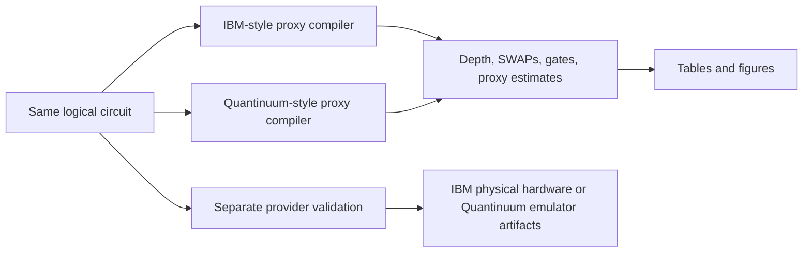

# Beginner Walkthrough

1. The project builds small circuits such as Bell, GHZ, Grover, and QFT.
2. Each circuit is saved as the same logical recipe before architecture-specific work begins.
3. The IBM-style proxy places qubits along limited connections.
4. The Quantinuum-style proxy allows every qubit to connect to every other qubit.
5. A compiler rewrites each recipe into operations the chosen proxy understands.
6. The code counts added SWAPs, gates, and depth.
7. It calculates clearly labeled timing and success **estimates** from documented assumptions.
8. CSV and JSON files store results before figures are made.
9. The report code draws figures from those stored rows.
10. Separate provider files record real IBM hardware and Quantinuum emulator evidence without mixing them into proxy results.

A run succeeds when tests pass, processed output is written, the report completes, and comparison against the baseline explains any differences. A tall bar does not automatically mean “better”; read its axis and evidence label first.
