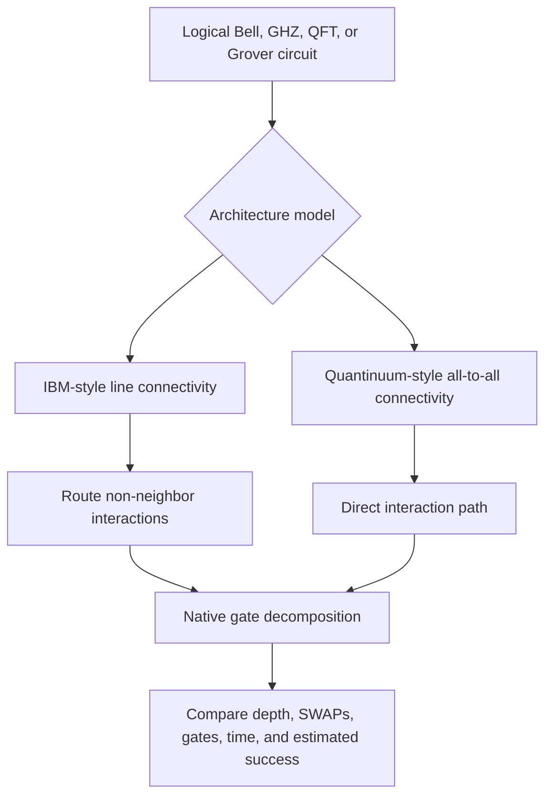
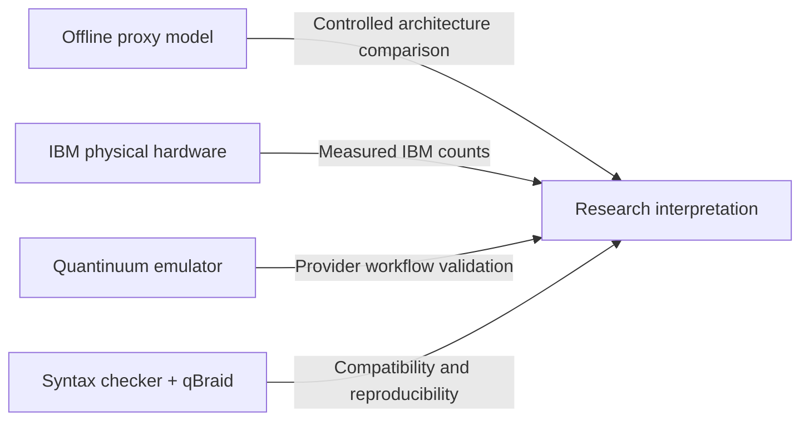

# Project Showcase

## Different Roads to the Same Circuit

**A visual tour of how hardware architecture changes quantum-circuit compilation**

[Back to the main README](../README.md) · [Read the beginner guide](BEGINNER_GUIDE.md) · [Review the limitations](LIMITATIONS.md)

---

## The main idea

A quantum algorithm begins as a logical circuit. Before that circuit can run, it must be translated into the gates and connections supported by a target architecture.

In this project, the same starting circuits are sent through two controlled proxy pipelines:

The project then keeps real-provider evidence in separate folders so that proxy estimates are never mistaken for measured device performance.

## Visual 1 — Proxy-estimated success

### Plain-language reading

Higher points mean the fixed model predicts a greater chance of completing the circuit without an error. The largest differences appear when circuit size and interaction complexity increase.

### Scientific caution

This is a **proxy estimate**, not measured IBM or Quantinuum hardware fidelity. The values depend on the error assumptions documented in the repository.

---

## Visual 2 — Routing SWAP cost

### Plain-language reading

A SWAP is an extra move used when two qubits that need to interact are not directly connected. The line-coupled model needs more of these detours for larger GHZ and QFT circuits. The all-to-all model avoids topology-driven SWAPs for the tested cases.

### Why it matters

A routing SWAP is not free. After native decomposition, it becomes several lower-level operations, increasing circuit depth and the number of entangling gates.

---

## Visual 3 — Estimated time and reliability

### Plain-language reading

Points farther right have longer estimated duration. Points higher up have better estimated success. Under the selected assumptions, the preferred region is toward the upper-left.

### Scientific caution

Both axes are calculated from fixed proxy timing and error assumptions. They are useful for a controlled comparison, not for claiming live device speed or fidelity.

---

## Visual 4 — IBM Kingston physical hardware

### Plain-language reading

For Bell and GHZ-style circuits, the expected output is concentrated in all-zero and all-one states. Higher values mean the real IBM hardware returned those expected patterns more often.

### Evidence label

**Physical hardware.** These counts came from saved IBM Kingston jobs and are documented separately from the proxy-model tables.

### Scientific caution

Expected-state probability is useful for these state-preparation circuits, but it is not a universal score for every quantum algorithm.

---

## Visual 5 — Quantinuum Nexus emulator

### Plain-language reading

Higher bars mean the provider-hosted emulator returned the expected answer pattern more often for the tested small circuits.

### Evidence label

**Provider emulator.** This validates the Quantinuum Nexus execution path and stored small-circuit behavior.

### Scientific caution

These are not physical H2 QPU measurements and should never be described as such.

---

## What the five visuals show together

| Question | Best figure | Main takeaway |
|---|---|---|
| How does routing differ? | Routing SWAP cost | Connectivity changes how much extra movement is required |
| How might extra operations affect outcomes? | Proxy-estimated success | More compiled work creates more modeled error exposure |
| How do modeled time and reliability interact? | Time–reliability tradeoff | Architecture overhead changes both axes under fixed assumptions |
| Was real IBM hardware used? | IBM Kingston figure | Yes, with measured evidence stored separately |
| Was the Quantinuum path executed? | Nexus emulator figure | Yes, on a provider emulator, not a physical H2 QPU |

## Evidence hierarchy

No evidence type is treated as interchangeable with another.

## Main conclusion

The project does **not** claim that one quantum architecture is always better. It shows something more precise:

> For the tested circuits, connectivity and native-gate constraints change the amount of compilation work required. Those structural differences become more visible as circuit size and interaction density increase.

## Continue exploring

| Topic | Document |
|---|---|
| Full experimental method | [Experiment protocol](EXPERIMENT_PROTOCOL.md) |
| Architecture assumptions | [Architecture](ARCHITECTURE.md) |
| Metric definitions | [Metrics](METRICS.md) |
| Every data column | [Data dictionary](DATA_DICTIONARY.md) |
| IBM job evidence | [IBM hardware validation](IBM_HARDWARE_VALIDATION.md) |
| Quantinuum evidence | [Quantinuum hardware validation](QUANTINUUM_HARDWARE_VALIDATION.md) |
| Figure-by-figure interpretation | [Figure interpretation guide](FIGURE_INTERPRETATION_GUIDE.md) |
| Manuscript relationship | [Manuscript–repository alignment](MANUSCRIPT_REPOSITORY_ALIGNMENT.md) |
| Reuse warnings | [Limitations](LIMITATIONS.md) |

---

**The goal is not a flashy hardware ranking. The goal is a transparent, reproducible explanation of architecture cost.**

