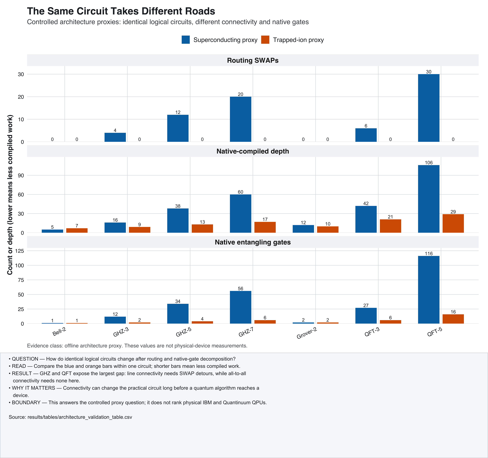
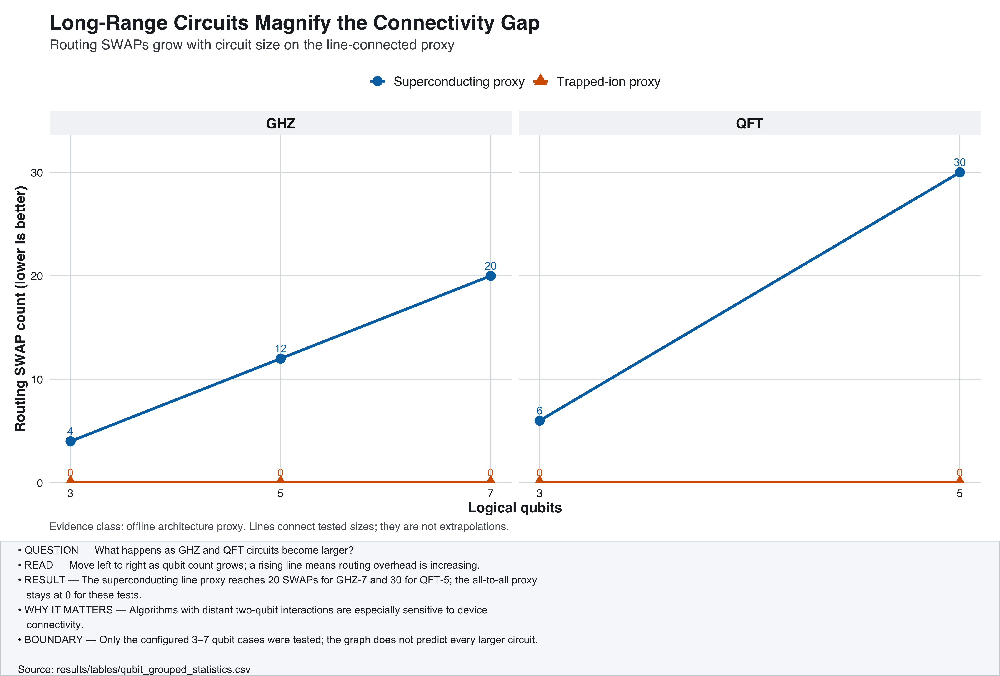
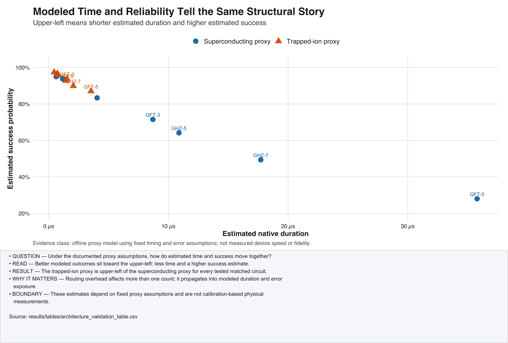
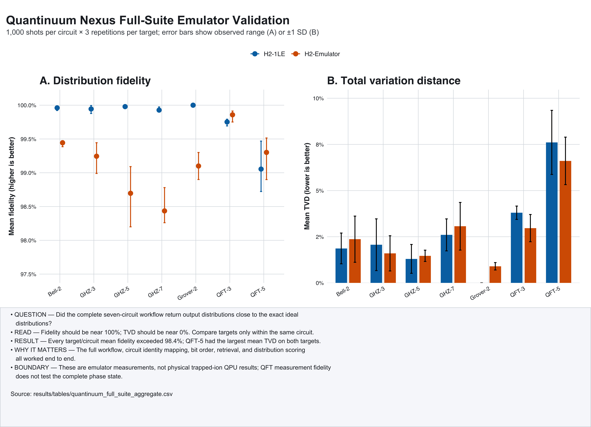

# Publication Figures

These four figures are the final publication set. Each is available as a high-resolution
400-DPI PNG and a vector PDF.

## 1. Research Question Answer



- **What it is:** Three matched bar graphs for routing SWAPs, native depth, and native
  entangling gates.
- **How to read it:** Compare blue and orange within one circuit. A shorter bar means the
  compiled circuit needs less work for that metric.
- **What it means:** GHZ and QFT reveal the largest architecture gap. The line proxy
  needs routing detours; the all-to-all proxy does not need them for these circuits.
- **Why it matters:** The same algorithm can impose very different implementation costs
  on different connectivity layouts.
- **Limit:** These are controlled proxy results, not physical-provider measurements.

## 2. Connectivity Scaling



- **What it is:** Routing SWAP count as tested GHZ and QFT circuits grow.
- **How to read it:** Move from left to right as the number of qubits increases. A rising
  line means more routing work.
- **What it means:** The line proxy reaches 20 SWAPs for GHZ-7 and 30 for QFT-5. The
  all-to-all proxy remains at zero for the tested sizes.
- **Why it matters:** Long-range interactions make connectivity increasingly important.
- **Limit:** Lines join measured test sizes; they do not predict untested circuit sizes.

## 3. Modeled Time And Reliability



- **What it is:** Estimated duration on the horizontal axis and estimated success on the
  vertical axis.
- **How to read it:** The upper-left is better within this model: shorter estimated time
  and higher estimated success.
- **What it means:** The trapped-ion proxy is upper-left of the superconducting proxy for
  every tested matched circuit.
- **Why it matters:** Routing overhead can propagate into modeled time and error exposure.
- **Limit:** Both quantities use fixed proxy assumptions, not live device calibrations.

## 4. Quantinuum Emulator Validation



- **What it is:** Mean classical distribution fidelity and mean TVD for the complete
  seven-circuit suite on two Nexus emulator targets.
- **How to read it:** Fidelity should be close to 100%; TVD should be close to 0%.
- **What it means:** Every target/circuit mean fidelity exceeded 98.4%. QFT-5 had the
  largest mean TVD on both targets.
- **Why it matters:** The full submission, identity mapping, retrieval, bit ordering, and
  scoring workflow completed end to end.
- **Limit:** These are emulator measurements, not physical Quantinuum QPU results. QFT
  output-distribution fidelity does not validate the complete phase state.

## Recreate The Figures

From the repository root:

```bash
Rscript scripts/generate_publication_figures.R
```

The script validates the expected row counts, circuit identities, emulator targets,
repetition totals, and 42,000-shot total before writing any figure.
